# Lab-4-Impedance Control

## Introducción 
El objetivo de esta práctica es diseñar e implementar un controlador de impedancia controlar y manipulador de dos grados de libertad 
con ayuda de ROS2.

Posteriormente, se cambiarán los parámetros de las impedancias para ver como se comporta el manipulador al aplicarle diferentes
fuerzas externas y se arreglarar el problema del acoplamiento cruzado que se produce en el robot. 

Finalmente, se cambiará la posición deseada del robot para ver como se comporta el sistema. 

## Fundamentos teóricos

Para diseñar el controlador de impedancias se aplicará el siguiente diagrama de bloques con el cual se produce el control de impedancias. 

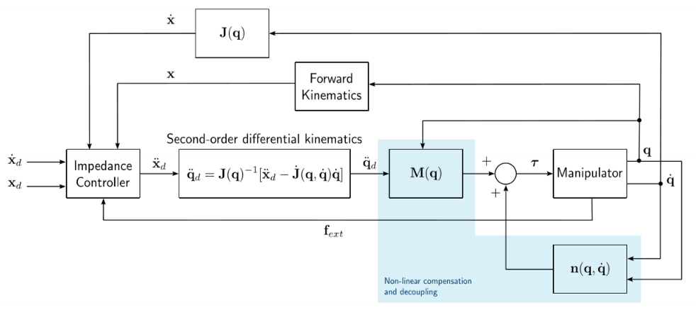

El esquema está formado por:

- Forward Kinematics: se encarga de optener la posición del EE en el espacio cartesiano a partir de de las coordenadas articulares ($$q$$). Para eso
se aplica la siguiente fórmula:

$$\mathbf{x} = 
\begin{bmatrix}
l_1\cos(q_1) + l_2\cos(q_1 + q_2) \\
l_1\sin(q_1) + l_2\sin(q_1 + q_2)
\end{bmatrix}$$

- Differential Kinematics ($$J(q)$$): se escaga de obtener las velocidades cartesianas a partir de las velocidades articulares.
Se aplica la siguiente fórmula:

$$\dot{\mathbf{x}} = \mathbf{J}(\mathbf{q})\dot{\mathbf{q}}$$

- Control de impedancia: es este bloque se realiza el control de impedancia del manipulador. Para ello, se le dice a la cadena cinemática la
aceleración deseada a partir de los datos recibidos de los sensores. A partir del modelo de impedancia de segundo orden:

$$\mathbf{M}\ddot{\tilde{\mathbf{x}}} + \mathbf{B}\dot{\tilde{\mathbf{x}}} + \mathbf{K}\tilde{\mathbf{x}} = \mathbf{f}_{ext}$$

donde M es la inercia simulada del efecto final, B es la "fricción" que tendrá el efector final al moverse y K cuánta fuerza intentará el robot volver a su posición objetivo si se empuja. 

Se obtienen las aceleraciones deseadas:

$$\ddot{\mathbf{x}}_d = \mathbf{M}^{-1}(\mathbf{f}_{ext} - \mathbf{B}\dot{\tilde{\mathbf{x}}} - \mathbf{K}\tilde{\mathbf{x}})$$

Donde: $\tilde{\mathbf{x}} = \mathbf{x} - \mathbf{x}_d$ y $\dot{\tilde{\mathbf{x}}} = \dot{\mathbf{x}} - \dot{\mathbf{x}}_d$.

- Aceleraciones deseadas: pasa las aceleraciones del espacio cartesiano al articular. Para ello, se implementa la inversea de la ecuación
de la cinemática diferencial de segundo orden:

$$\ddot{\mathbf{x}} = \mathbf{J}(\mathbf{q})\ddot{\mathbf{q}} + \dot{\mathbf{J}}(\mathbf{q}, \dot{\mathbf{q}})\dot{\mathbf{q}}$$

$$\ddot{\mathbf{q}} = \mathbf{J}(\mathbf{q})^{-1}[\ddot{\mathbf{x}} - \dot{\mathbf{J}}(\mathbf{q}, \dot{\mathbf{q}})\dot{\mathbf{q}}]$$


## Código implementado

Para calcular estas fórmulas, es necesario calcular anteriormente las matrices jacobianas. Para ello, se implementa la función $$Jacobians Update$$.

Es ella se calculan las matrices jacobianas de la posición y la velocidad:

$$\mathbf{J}(\mathbf{q}) = 
\begin{bmatrix}
-l_1\sin(q_1) - l_2\sin(q_1 + q_2) & -l_2\sin(q_1 + q_2) \\
l_1\cos(q_1) + l_2\cos(q_1 + q_2) & l_2\cos(q_1 + q_2)
\end{bmatrix}$$

$$\dot{\mathbf{J}}(\mathbf{q}, \dot{\mathbf{q}}) = 
\begin{bmatrix}
-l_1\cos(q_1)\dot{q}_1 - l_2\cos(q_1 + q_2)(\dot{q}_1 + \dot{q}_2) & -l_2\cos(q_1 + q_2)\dot{q}_2 \\
-l_1\sin(q_1)\dot{q}_1 - l_2\sin(q_1 + q_2)(\dot{q}_1 + \dot{q}_2) & -l_2\sin(q_1 + q_2)\dot{q}_2
\end{bmatrix}$$

En el siguiente código:
```cpp
// Method to update jacobian and jacobian derivative
void update_jacobians()
{
    // Declaramos las variables locales a partir de los atributos de la clase
    double q1 = joint_positions_(0);
    double q2 = joint_positions_(1);
    double q_dot1 = joint_velocities_(0);
    double q_dot2 = joint_velocities_(1);
    // Placeholder for jacobian and jacobian_derivative matrices

    // Calculate J(q)
    jacobian_ << (-l1_ * std::sin(q1)) - (l2_ * std::sin(q1 + q2)), -l2_ * std::sin(q1 + q2),
             (l1_ * std::cos(q1)) + (l2_ * std::cos(q1 + q2)),  l2_ * std::cos(q1 + q2);

    // Calculate J'(q,q')
    jacobian_derivative_ << (-l1_ * std::cos(q1) * q_dot1) - (l2_ * std::cos(q1 + q2) * q_dot1), -l2_ * std::cos(q1 + q2) * q_dot2,
                        (-l1_ * std::sin(q1) * q_dot1) - (l2_ * std::sin(q1 + q2) * q_dot1), -l2_ * std::sin(q1 + q2) * q_dot2;

    RCLCPP_INFO(this->get_logger(), "Jacobian:\n[%.3f, %.3f]\n[%.3f, %.3f]",
                jacobian_(0, 0), jacobian_(0, 1),
                jacobian_(1, 0), jacobian_(1, 1));

    double det = jacobian_.determinant();
    RCLCPP_INFO(this->get_logger(), "Jacobian determinant: %.6f", det);
}

```

Posteriormente, las funciones mencionadas anteriormente, está implementadas de la siguiente forma:

- differential_kinematics:

```cpp
// Method to calculate Cartesian velocity with the first-order differential kinematics
Eigen::MatrixXd differential_kinematics()
{
    // Placeholder for first-order differential kinematics
    Eigen::VectorXd x_dot(2);
    x_dot = jacobian_ * joint_velocities_; // antes había <<

    return x_dot;
}
```

- forward_kinematics

```cpp
// Method to calculate forward kinematics
Eigen::VectorXd forward_kinematics()
{
    // Declaramos las variables locales a partir de los atributos de la clase
    double q1 = joint_positions_(0);
    double q2 = joint_positions_(1);

    // Placeholder for forward kinematics x = [l1_ * cos(q1) + l2_ * cos(q1 + q2), l1_ * sin(q1) + l2_ * sin(q1 + q2)]
    Eigen::VectorXd x(2);
    x << (l1_ * std::cos(q1)) + (l2_ * std::cos(q1 + q2)),
         (l1_ * std::sin(q1)) + (l2_ * std::sin(q1 + q2));

    return x;
}
```

- impedance_controller

```cpp
// Method to compute the impedance controller
Eigen::VectorXd impedance_controller()
{
    // Placeholder for impedance controller calculation
    Eigen::VectorXd x_dot_d = Eigen::VectorXd::Zero(2); // We assume desired cartesian velocity = 0

    // Calculate Cartesian errors
    Eigen::VectorXd x_error(2);
    x_error = cartesian_pose_ - equilibrium_pose_;
    Eigen::VectorXd x_dot_error(2);
    x_dot_error = cartesian_velocities_ - x_dot_d;

    // Replace with actual impedance controller equation: x'' = M^(-1)[F_ext - k x_error - B x'_error]
    Eigen::VectorXd x_ddot(2);
    x_ddot = mass_matrix_.inverse() * (external_wrenches_ - (damping_matrix_ * x_dot_error) - (stiffness_matrix_ * x_error));
    // antes era <<
    return x_ddot;
}
```

- calculate_desired_joint_accelerations

```cpp
// Method to calculate joint acceleration with the inverse of second-order differential kinematics
Eigen::VectorXd calculate_desired_joint_accelerations()
{
    // Placeholder for the second-order differential kinematics
    // q'' = J(q)^(-1)[x'' - J'(q,q')q']

    RCLCPP_INFO(this->get_logger(), "x_ddot: [%.3f, %.3f]",
                desired_cartesian_accelerations_(0), desired_cartesian_accelerations_(1));

    Eigen::VectorXd q_ddot = jacobian_.inverse() * (desired_cartesian_accelerations_ - (jacobian_derivative_ * joint_velocities_));;

    return q_ddot;
}
```


Al lanzar los código se puede ver las siguintes iterración entre los bloques:

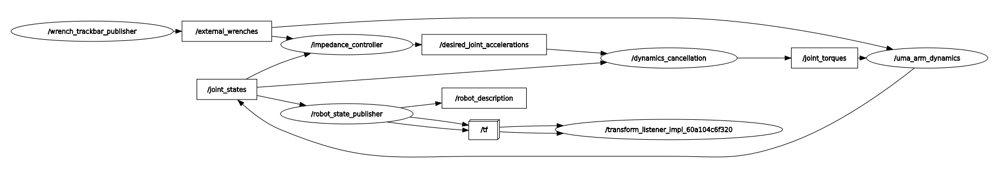

Se puede observar como el programa con el cual se simulan las fuerzas externas (/wrench_trackbar_publisher), pasa las fuerzas 
al  a través del topic /external_wrenches al /impedance_controller, el cual calcula las velocidades deseadas. Al bloque /impedance_controller
también le entran las velocidades y posiciones articulares, las cuales se pasan al espacio cartesiano dentro del bloque. Dentro del bloque
también se pasan las aceleraciones deseadas el espacioi cartesiano al articular. 

Esas aceleraciones van al bloque de /dynamics_cancellation, donde se implementó la compensación  dinámica en anteriores prácticas. Las 
aceleraciones se pasan por el topic /desired_joint_accelerations. 

Con el bloque de /dynamics_cancellation, se calculan los torques que debe aplicar cada articulación para estar en una posición. Esos torques
pasan a través del topic /joint_torques al bloque /uma_arm_dynamics que calcula las posción, velocidad y aceleración de cada articulación 
tras aplicarle los torques interno. Esos parámetros se llevan al resto de bloques para ser representados en la simulación y ser usados
en el resto de bloques. 


## Resultados

Se han realizado varias pruebas con diferentes parámetros para ver cómo se comporta el manipulador en cada caso.

### Prueba con parámetros por defecto

Para esta prueba se han usado los siguientes parámetros:
*   `M`: [1.0, 0.0, 0.0, 1.0] 
*   `B`: [100.0, 0.0, 0.0, 100.0]
*   `K`: [250.0, 0.0, 0.0, 250.0]

Se obtienen los siguientes resultados:

- Muestra en vídeo
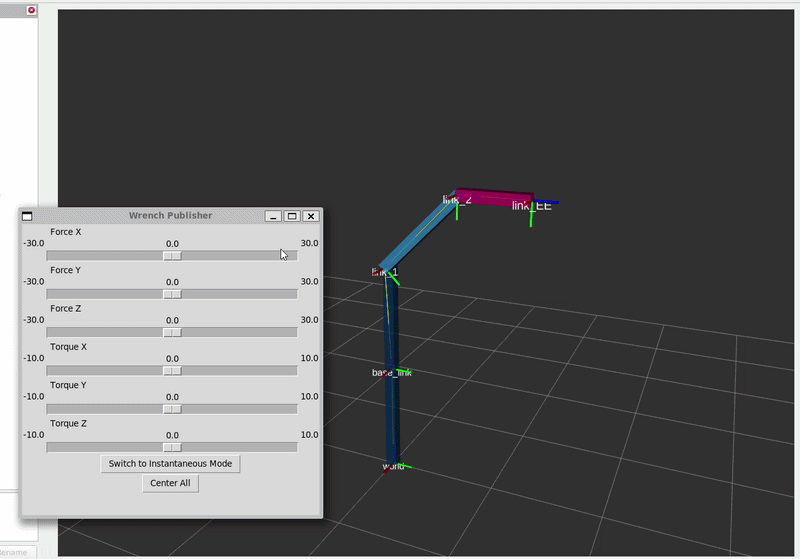


- Muestra gráfica
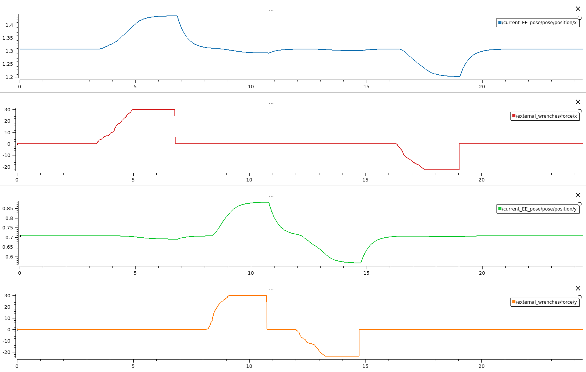

Se puede observar como el manipulardor, según aumenta la fuerza aplicada, se va a adaptando a dicha fuerza. Si no existeriera esa compensación
por impedancias, el robot buscaría volvel a la misma posición donde estaba, a pesar de aplicarle la fuerza externa. 

En la gráfica también se puede observar cómo una fuerza aplicada en el eje y también afecta en la posición en x, y vicerversa. Eso es debido a que la matriz de inercia $$M_x$$ no es diagonal, eso quiere decir que al aplicar una fuerza, esa fuerza se transmite por los eslabones haciendo girar el resto de articulaciones. Este problema se solucionará posteriormente.

### Prueba con M = 10

Para esta prueba se han usado los siguientes parámetros:
*   `M`: [10.0, 0.0, 0.0, 10.0] 
*   `B`: [100.0, 0.0, 0.0, 100.0]
*   `K`: [250.0, 0.0, 0.0, 250.0]

Se obtienen los siguientes resultados:

- Muestra en vídeo
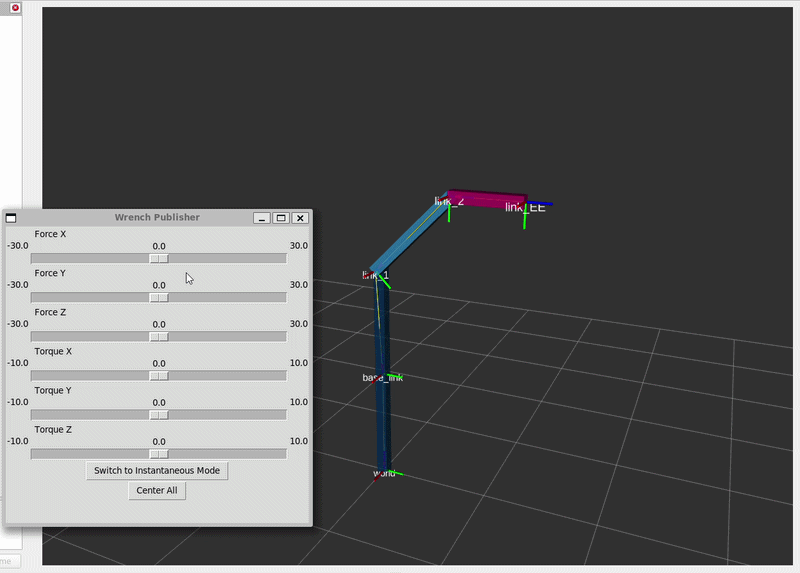


- Muestra gráfica
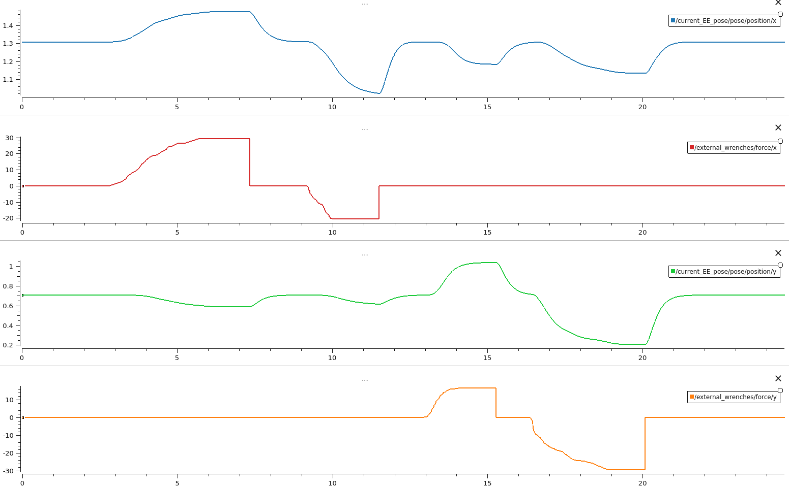

Al aumentar el valor de M, es cómo si se aumentará el peso del EE. Al aumentar el valor de la masa, es más complicado movel el efector final aplicándole una fuerza ya que la acelecarión deseada disminuye. Por lo tanto, hay que aplicarle mayor fuerza para moverlo la misma distancia. 
Además, al tener más masa tiene mayor inercia, haciendo que sea más dificil de controlar, por esa razón hay mayor movimiento en eje opuesto al cual se aplica la fuerza. 

### Prueba con B = 10

Para esta prueba se han usado los siguientes parámetros:
*   `M`: [1.0, 0.0, 0.0, 1.0] 
*   `B`: [10.0, 0.0, 0.0, 10.0]
*   `K`: [250.0, 0.0, 0.0, 250.0]


Se obtienen los siguientes resultados:

- Muestra en vídeo
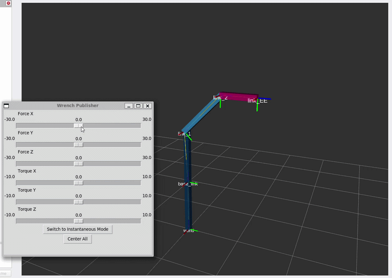


- Muestra gráfica
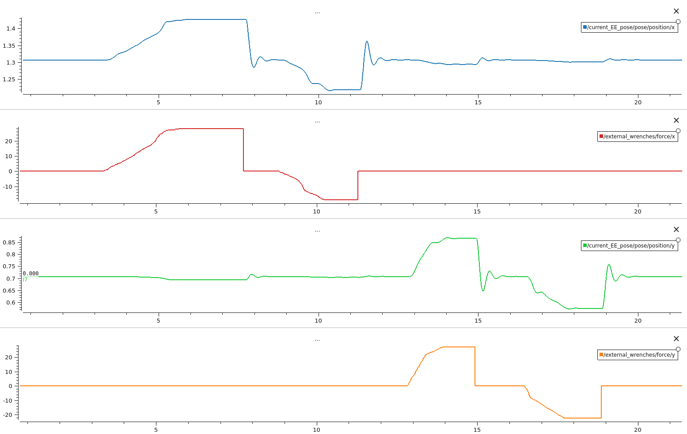

Al diminuir la constante de amoriguamiento, el EE tiene mayor sensibilidad ante los cambios haciendo que una fuerza externas haga un cambio más brusco en el manipulador.
Es como si empeoráramos los "frenos" del EE.


### Prueba con K = 25

Para esta prueba se han usado los siguientes parámetros:
*   `M`: [1.0, 0.0, 0.0, 1.0] 
*   `B`: [10.0, 0.0, 0.0, 10.0]
*   `K`: [25.0, 0.0, 0.0, 25.0]


Se obtienen los siguientes resultados:

- Muestra en vídeo
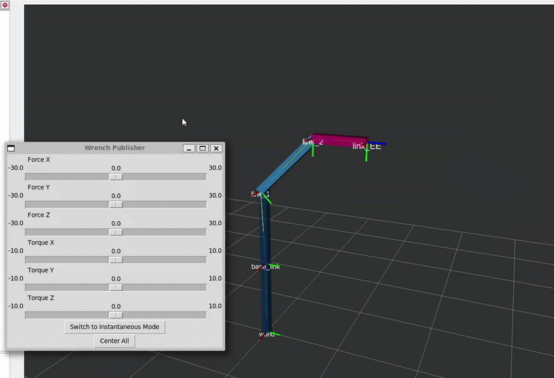


- Muestra gráfica
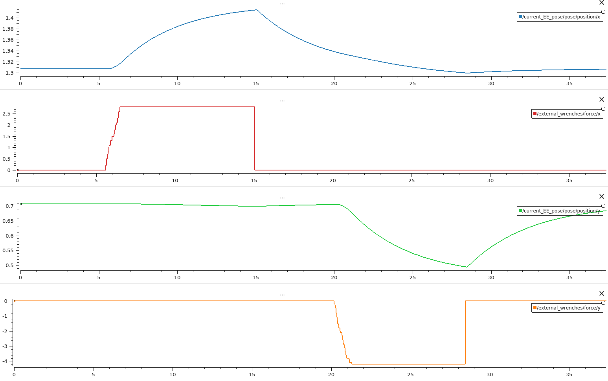

Al disimuir la contante k, es como si estuvieramos tirando de un muelle capaz de estirarse más. Por lo que, al poder estirarse en mayor medida, los cambios que se producen
en el EE, son más lentos ya que el "muelle" tira menos del efector final al aplicarle la fuerza.

### Prueba con impedancia en 'X' y 'Y' diferentes

Para esta prueba se han usado los siguientes parámetros:
*   `M`: [1.0, 0.0, 0.0, 1.0] 
*   `B`: [10.0, 0.0, 0.0, 10.0]
*   `K`: [25.0, 0.0, 0.0, 25.0]


Se obtienen los siguientes resultados:

- Muestra en vídeo
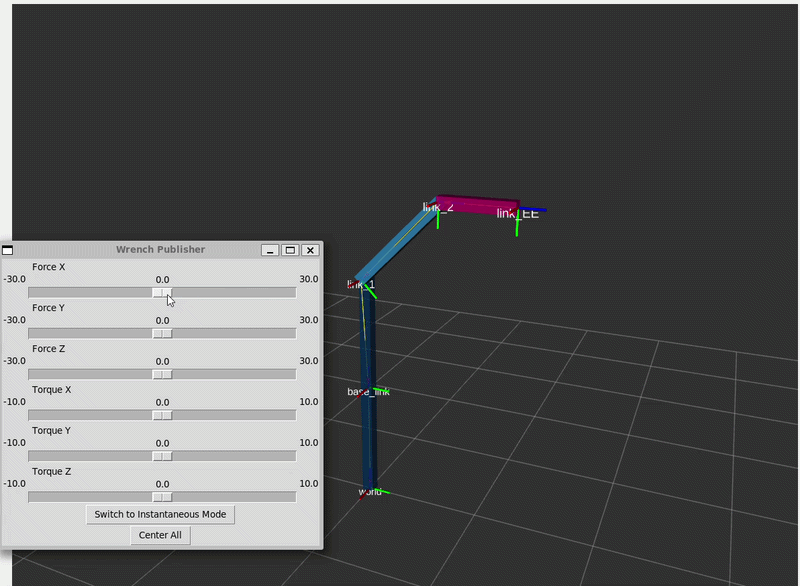


- Muestra gráfica
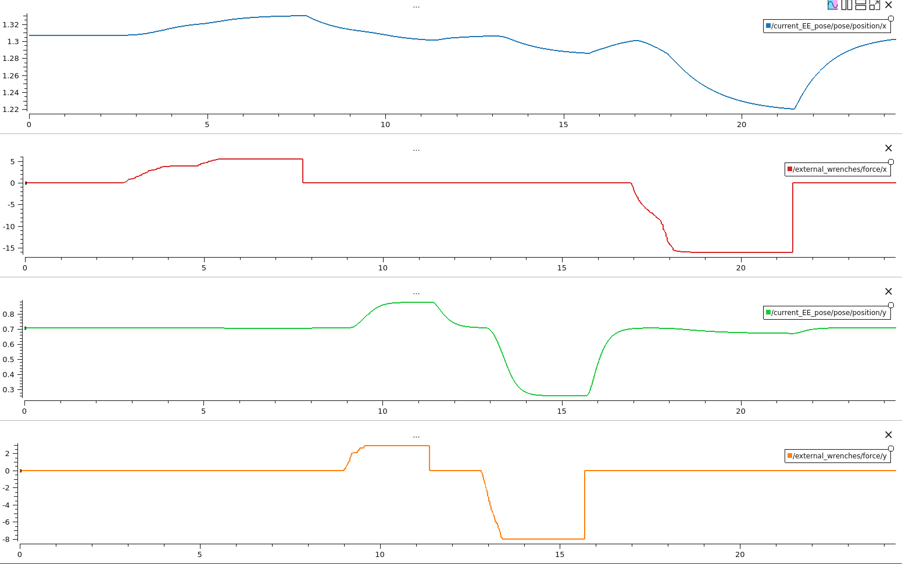

Por último, al cambiar los parámetros de forma asimétrica, cada eje tendrá por lo tanto un comportamiento asímetrico de la misma forma.


### Solución sobre el acoplamiento cruzado 


 
